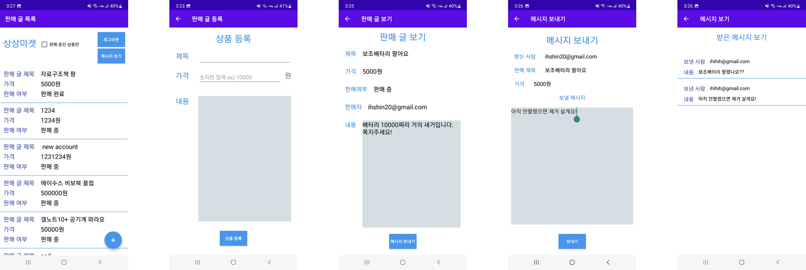

# 🛒 상상마켓: 중고 거래 마켓 애플리케이션

**설명:** 안드로이드용 중고 거래 마켓 애플리케이션입니다.

## 프로젝트 정보

- **개발 기간:** 2023-11-06 ~ 2023-12-01
- **개발 언어:** Kotlin, Java
- **개발 도구:** Android Studio, Firebase

## 주요 기능
&nbsp;로그인한 사용자들이 판매글을 올려 중고거래를 할 수 있습니다. 판매자는 가격 조정 및 판매 여부에 따른 판매글을 수정할 수 있으며, 다른 사용자들은 판매자에게 메시지를 보낼 수 있습니다.
Firebase auth를 이용해 사용자의 계정을 관리하고, FirtStore를 이용해 애플리케이션에 등록되는 중고거래 데이터들을 관리합니다.

